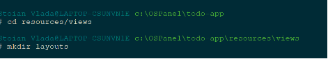
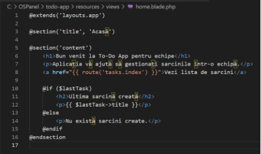

**UNIVERSITATEA DE STAT DIN MOLDOVA**

FACULTATEA „MATEMATICĂ ŞI INFORMATICĂ”

DEPARTAMENTUL“INFORMATICĂ APLICATA”


Framework
# Lucrare de laborator nr. 2.
# Cereri HTTP și șablonizare în Laravel


`                                `Realizat : Stoian Vladimira

`                              `Grupa: IA2201

`                                `Verificat: Nichita Nartea


Chişinău 2024
## Condiții
### **Nr. 1. Pregătirea pentru lucru, instalarea Laravel**
Aici instalam Laravel, obs si comanda pentru crearea proiectului:

composer create-project laravel/laravel:^10 todo-app


Aici intram in directorul proiectului :
```http
cd todo-app
```
dupa pornesc several Laravel :
```http
php artisan serve
```


**Întrebare**: Ce vedeți în browser când deschideți pagina <http://localhost:8000>?

Vad pagina implicită de bun venit din Laravel, care confirmă că serverul funcționează corect. Pagina are un design simplu cu textul "Laravel" și include câteva linkuri către documentație.


### **Nr. 2. Configurarea mediului**
Deschid fișierul .env și fac modificările:


Generez cheia aplicației:


**Întrebare**: Ce s-ar întâmpla dacă această cheie ar ajunge pe mâna unui răufăcător?

Dacă cheia ar ajunge în mâinile unui răufăcător, acesta ar putea decripta informațiile criptate de aplicație, inclusiv date sensibile cum ar fi sesiunile utilizatorilor sau token-urile de autentificare.

### **Nr. 3. Principiile de bază ale lucrului cu cererile HTTP**
#### *Nr. 3.1. Crearea rutelor pentru pagina principală și pagina "Despre noi"*
Creez controllerul HomeController:


Adaug metoda index în HomeController si  metoda pentru pagina "Despre noi" în HomeController:
Deasemenea sunt vizibile si rutile:


#### *Nr. 3.2. Crearea rutelor pentru sarcini*
Am creeat controller TaskController, utilizat controllerul de resurse:

php artisan make:controller TaskController

Mai jos va fi exemplu cu metodele index, create, store, show, edit, update, destroy


- **Întrebare**: Explicați diferența între crearea manuală a rutelor și utilizarea unui controller de resurse. Ce rute și ce nume de rute vor fi create automat?

Crearea manuală a rutelor necesită adăugarea fiecărei rute individuale, specificând metodele HTTP. Utilizarea unui controller de resurse simplifică acest proces prin generarea automată a tuturor rutelor CRUD. De exemplu, Route::resource va crea rute precum tasks.index, tasks.show, tasks.create, etc., asociate corect cu metodele HTTP (GET, POST, PUT, DELETE).

` `Verificați rutele create cu ajutorul comenzii php artisan route:list:


### **Nr. 4. Șablonizarea folosind Blade**
#### *Nr. 4.1. Crearea unui layout pentru pagini*
1. Creați un layout pentru paginile principale layouts/app.blade.php cu următoarele elemente comune ale paginii:
   1. Titlul paginii;
   1. Meniu de navigare;
   1. Conținutul paginii.
1. Folosiți directiva @yield pentru a defini zona în care va fi inserat conținutul diferitelor pagini.




#### *Nr. 4.2. Utilizarea șabloanelor Blade*
Creați vizualizarea pentru pagina principală home.blade.php:


Creați vizualizarea pentru pagina "Despre noi" about.blade.php:


Creați vizualizări pentru sarcini cu următoarele șabloane în directorul resources/views/tasks:

·  index.blade.php (lista de sarcini)

·  show.blade.php (afișarea unei sarcini)


**Explicații**

1. **index.blade.php:**
   1. Această pagină afișează o listă de sarcini. Fiecare sarcină este un link care duce la pagina de afișare a detaliilor sarcinii (fișierul show.blade.php).
   1. Se folosește directiva @foreach pentru a itera printr-o colecție de sarcini (asigură-te că aceste date sunt transmise din controller).
1. **show.blade.php:**
   1. Această pagină afișează detalii despre o sarcină specifică. Folosește variabila $task, care ar trebui să fie un array sau un obiect ce conține detalii despre sarcină.
   1. Oferă un link pentru a reveni la lista de sarcini.

Pentru ca aceste vizualizări să funcționeze corect, ma asigur că în controllerul TaskController transmiți datele necesare:


#### *Nr. 4.3. Componente anonime Blade*
Creați o componentă anonimă pentru afișarea antetului (header). Folosiți componenta creată în layoutul layouts/app.blade.php. 


Creează fișierul de vizualizare pentru antet:


Crearea unei componente anonime pentru sarcini:


Creează fișierul de vizualizare pentru sarcină:


#### *Nr. 4.4. Stilizarea paginilor*
Adăugați stiluri pentru pagini folosind CSS


Include stilurile în layouts/app.blade.php:


### **Nr. 5. Sarcini suplimentare**
Afișați ultima sarcină creată pe pagina principală folosind View Composer


Afișează ultima sarcină în home.blade.php:


Componentă anonimă pentru afișarea priorității sarcinii:


Include componenta de prioritate în show.blade.php:


**Întrebări de control**

1. **Ce este un controller de resurse în Laravel și ce rute creează?**
   1. Un controller de resurse în Laravel este un tip special de controller care oferă metode pentru a gestiona operațiile CRUD (Create, Read, Update, Delete) asupra resurselor. Creează automat rutele pentru operațiile standard: index, create, store, show, edit, update și destroy.
1. **Explicați diferența între crearea manuală a rutelor și utilizarea unui controller de resurse.**
   1. Crearea manuală a rutelor implică definirea fiecărei rute individual, ceea ce poate fi obositor și predispus la erori. Un controller de resurse simplifică acest proces, generând automat rutele necesare pentru operațiile standard, reducând astfel codul și îmbunătățind lizibilitatea.
1. **Ce avantaje oferă utilizarea componentelor anonime Blade?**
   1. Componentele anonime Blade facilitează reutilizarea codului, reducând duplicarea. Ele permit separarea logicii de prezentare, făcând șabloanele mai organizate și mai ușor de întreținut. De asemenea, pot fi personalizate prin transmiterea de parametri.
1. **Ce metode de cereri HTTP sunt folosite pentru a executa operațiunile CRUD?**
   1. Metodele HTTP folosite pentru operațiile CRUD sunt:
      1. **Create:** POST
      1. **Read:** GET
      1. **Update:** PUT/PATCH
      1. **Delete:** DELETE

